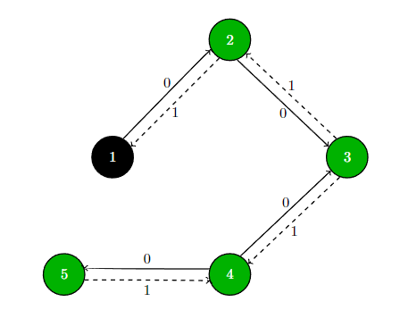

<!-- PROJECT SHIELDS -->
<!--
*** I'm using markdown "reference style" links for readability.
*** Reference links are enclosed in brackets [ ] instead of parentheses ( ).
*** See the bottom of this document for the declaration of the reference variables
*** for contributors-url, forks-url, etc. This is an optional, concise syntax you may use.
*** https://www.markdownguide.org/basic-syntax/#reference-style-links
-->

[//]: # ([![CI][ci-shield]][ci-url])
[//]: # ([![Jira][jira-shield]][jira-url])
[//]: # ([![MIT License][license-shield]][license-url])
[![LinkedIn][linkedin-shield]][linkedin-url]

<!-- PROJECT LOGO -->
 

  

<h3 align="center">Kernal problem</h3>

Algorithm for solving Kernal problem
 
<a href="https://github.com/lukaszmichalskii/PWRRT22"><strong>Explore the docs »</strong></a>
 
 
<a href="https://github.com/lukaszmichalskii/PWRRT22">View Demo</a>
·
<a href="https://github.com/lukaszmichalskii/PWRRT22/issues">Report Bug</a>
·
<a href="https://github.com/lukaszmichalskii/PWRRT22/issues">Request Feature</a>

<!-- TABLE OF CONTENTS -->
## Table of Contents

* [Problem](#problem)
    * [Model](#model)
    * [Graph](#graph)
* [Optimizations](#optimizations)
    * [Branch & Bound](#branch--bound)
* [Proof of Concept](#proof-of-concept)
* [Tests](#tests)
* [Technologies](#technologies)

<!-- PROBLEM -->
## Problem
Problem can be represented as weighted directed graph $G=(V, E)$. Finding the path with minimum violations of the law
might be realized by traversing the entire graph using [DFS (depth-first search)](https://en.wikipedia.org/wiki/Depth-first_search), [BFS (breadth-first search)](https://en.wikipedia.org/wiki/Breadth-first_search) or [Best-first search](https://en.wikipedia.org/wiki/Best-first_search), and keep updating the optimal
solution. This approach time complexity is $O(|V|\cdot|E|)$, where $|V|$ is the number of vertices (cities) and $|E|$ 
is number of roads available.
<!-- MODEL -->
### Model
Using example input, we can create a model of the problem. The kingdom is represented as a directed graph
with cities as nodes and roads as edges. Traveling according to the direction of a one-way road
does not violate the law, so the edge representing such a road has a weight associated with 0 (no mandate).
On the other hand, if a tourist travels contrary to the regulations he receives a mandate and the edge weight is 1.
<!-- GRAPH -->
### Graph
Example representation:
- dashed arrows stands for illegal direction

<!-- OPTIMIZATIONS -->
## Optimizations
From problem specifications, we know the LB (lower bound) and UB (upper bound)
- LB - the minimum possible cost associated with the given path = 0.
- UB - using explored local solution set UB to cost associated with a path.
<!-- BB -->
### Branch & Bound
Using [*Branch and Bound*](https://en.wikipedia.org/wiki/Branch_and_bound) algorithm design paradigm for combinatorial optimization
we shrink the state space using LB & UB and perform a search on reduced space. If we get
a path from the start to our goal with a cost equal to 0 there is no need to check another possible path we found the optimal route
based on mandate numbers (do not care about optimal path length). If during traversal we find the path that estimated cost
exceeds the UB skip the unexplored part of the traversal tree (impossible to find a better solution there).
In the worst case, this technique works like DFS/BFS or Best-first search.

<!-- PROOF-OF-CONCEPT -->
## Proof of Concept
Prototype of described idea was written in Python 3 using [*networkx*](https://networkx.org/) package.
Implementation uses DFS as traversal method.

<!-- TESTS -->
## Tests
Algorithm passed manual tests for problem instances avaliable in `resources/problem_instances`:
- maze.txt
- island.txt
- input.txt

<!-- TECHNOLOGIES -->
## Technologies
1. Application is build in C++ 14 standard using CLion IDE by JetBrains and WSL2 (Ubuntu 20.04.4 LTS).
2. Prototype script written in Python 3.8.10 and [*networkx*](https://networkx.org/) package

<!-- USAGE -->
## Usage
Root of the project contains `Kernals` file ready to use for manual testing. Program 
as argument takes the absolute path to problem instance in space separated format:

`5 5 2 3` - nodes number edges number starting point destination

`1 2` - edge 1 -> 2

`3 1` - edge 3 -> 1

`3 4` - edge 3 -> 4

`4 1` - edge 4 -> 1

`4 2` - edge 4 -> 2

Execute program in Linux environment:
`./Kernals abs_filepath`

Output (from example above): 

`Min: 2,
Path: [2 -> 1 -> 3]`

<!-- MARKDOWN LINKS & IMAGES -->
<!-- https://www.markdownguide.org/basic-syntax/#reference-style-links -->
[contributors-shield]: https://img.shields.io/github/contributors/lukaszmichalskii/repo.svg?style=flat-square
[contributors-url]: https://github.com/lukaszmichalskii/PWRRT22/graphs/contributors
[forks-shield]: https://img.shields.io/github/forks/lukaszmichalskii/repo.svg?style=flat-square
[forks-url]: https://github.com/lukaszmichalskii/PWRRT22/network/members
[stars-shield]: https://img.shields.io/github/stars/lukaszmichalskii/repo.svg?style=flat-square
[stars-url]: https://github.com/lukaszmichalskii/PWRRT22/stargazers
[issues-shield]: https://img.shields.io/github/issues/lukaszmichalskii/repo.svg?style=flat-square
[issues-url]: https://github.com/lukaszmichalskii/PWRRT22/issues
[linkedin-shield]: https://img.shields.io/badge/-LinkedIn-black.svg?style=flat-square&logo=linkedin&colorB=555
[linkedin-url]: https://www.linkedin.com/in/lukasz-michalski-823106202/
